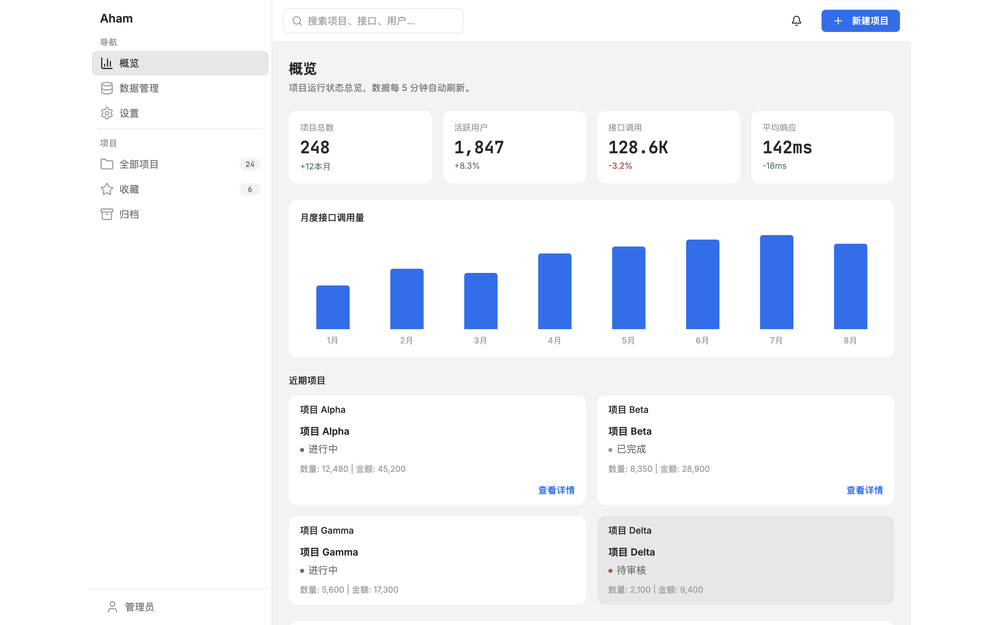
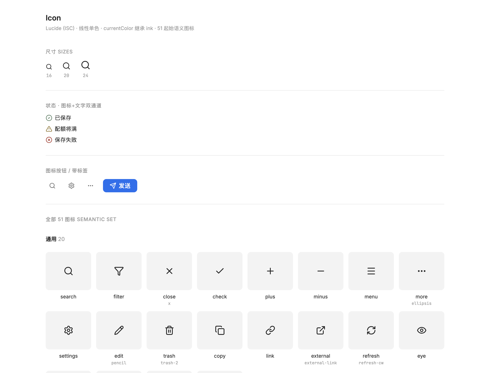

# Aham UI — 供 AI 消费的设计系统

## 为什么做

让 AI 画个界面，几秒钟的事。但同一个需求做三次——**字体、间距、颜色，常常是三个样**。你把要求说得再细，它每次还是在「凭感觉」。

问题不在 AI 不够聪明，在它手里**没有一份可依的标准**。

这套设计系统为此而做：把一整套设计语言，写成一份**机器可读、自洽**的单一事实源，AI 据此产出、处处一致。它不是给人看的规范文档，是**供 AI 消费**的设计系统——写一次，AI 每次都照着来。

## 定位

产出的不是「某一个还行的界面」，而是一套**可定义、可复用、可传承的设计系统**：

- **一致** — 取值集中在单一事实源 `tokens.json`，AI 每次从同一处取值，输出不再漂移。
- **可定义** — 颜色 / 字号 / 间距 / 组件规则都是机读取值，可精确描述、可 diff、可版本管理。
- **考虑全** — 从原则到页面布局分**八层**成文，组件带机读契约（什么别乱造），不会漏。
- **克制一致** — 冷色的纸、钢蓝点缀、扁平无阴影、状态 = 符号 + 文字，是这套设计的性格。

> 简言之：做的是「一套规范 + 据规范产出的一致性」，不是「一次性的漂亮界面」。

## 能做什么

核心是「取值 / 规范 / 组件」三层，让样式可定义、产出可一致：

- **单一事实源（取值）** — `design-system/tokens.json`：颜色（亮 + 暗）、文本样式、间距、圆角、尺寸、图标。改这里 = 改全局。
- **完整规范（规则）** — `design-system/DESIGN.md` **八层**：原则 / 基础 / 控件与组件 / 组合规则 / 模式 / 介质落地 / 输入 / 系统支撑 / **页面布局体系（分网页·应用·Office·邮件四轨）**。
- **组件库（构件）** — **17 个组件**各带机读契约 `components/*.json` + 就地预览 `preview/*.html`；`components.css` / `colors_and_type.css` 即取即用；`ui_kits/dashboard/` 是成品示范。
- **图标** — [Lucide](https://lucide.dev)（ISC）**51 个语义图标**，线性单色、跟随文字色，状态图标必配文字。
- **Office 落地** — `aham-ui-office.md`：Word / Excel / PPT 的 HEX + 字体映射。
- **一键换品牌** — 改 `tokens.json`（色值 / 字体 / 字号）即换皮，下游 CSS / 组件 / Office 全部派生，不动代码。

## 预览

<table>
<tr>
<td width="50%"> <b>成品 dashboard</b> · 侧栏 + 指标 + 图表 + 状态，整屏全用 token 拼出</td>
<td width="50%"> <b>图标层</b> · Lucide(ISC) 51 件 · currentColor 继承 ink</td>
</tr>
<tr>
<td width="50%"> <b>组件 · 就地预览</b> · 只横线表 + 符号+文字状态 + 选中=墨色不用蓝</td>
<td width="50%"> <b>色板 + 文字</b> · 三层灰 + 单蓝 + 文字四级 + 文本样式</td>
</tr>
</table>

**🌗 亮 / 暗双色**（全景页右上角可切换）：

> 所有组件就地预览 → **在线全景页 <https://aham-aiapp.github.io/aham-ui/>**

## 开始使用

最简单：**把本仓库地址 `https://github.com/Aham-AIAPP/aham-ui` 发给 Claude，让它按 `design-system/` 消费**；或下载后把 `design-system/` 目录交给你的 AI。

**AI 消费顺序**：`SKILL.md`（品牌要点）→ `tokens.json`（值）→ `DESIGN.md`（八层规则）→ `components/` + `preview/`（契约与预览）→ `colors_and_type.css` / `components.css`（运行时）→ `examples/` + `ui_kits/`（成品）→ `aham-ui-office.md`（Office）。

> 想换成你自己的品牌？复制 `tokens.json`，改色值 / 字号 / 间距——下游 CSS、组件、Office 全部派生，**不改规则本身**。

---

## 更新记录

[Releases](https://github.com/Aham-AIAPP/aham-ui/releases) · [CHANGELOG](CHANGELOG.md)（Keep a Changelog · SemVer） · [CONTRIBUTING](CONTRIBUTING.md) · [MIT](LICENSE)

## 关于 Aham

> 把灵光一现，做成能用的 AI 工具。Aham 来自 *aha moment*，每个工具只把一件事做利落，共享同一套设计地基。

| 应用 | 一句话 |
|---|---|
| **Aham UI**（本仓库） | 供 AI 消费的设计系统——写一次规范，AI 产出处处一致 |
| [Aham Word](https://github.com/Aham-AIAPP/aham-word) | 供 AI 消费的 Word 规范——AI 据规范产出处处一致的 .docx |
| [Aham PPT](https://github.com/Aham-AIAPP/aham-ppt) | 克制的 AI PPT 制作技能——把素材做成方案级 PPT |
| Aham Excel | 供 AI 消费的 Excel 规范——开发中 🚧 |
| [Aham Voice](https://github.com/Aham-AIAPP/aham-voice) | 录音转写与会议纪要（macOS）——本地离线转写，纪要走你自己的模型 |
| [Aham Survey](https://github.com/Aham-AIAPP/aham-survey) | 现场调研工具（macOS）——本地优先，把现场对话做成结构化调研成果 |

来源与脱敏说明见 [`ORIGIN.md`](ORIGIN.md)。

### 关注 · 交流

公众号看更多 AI 工具实践与更新；也欢迎扫码加我，交流与反馈。

