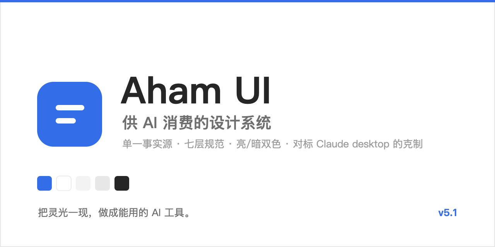
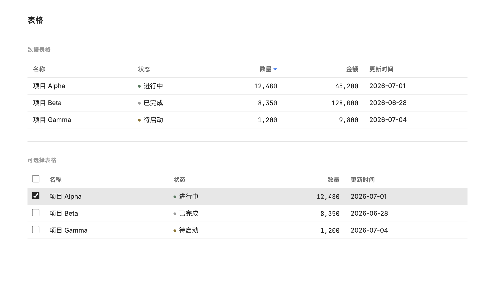
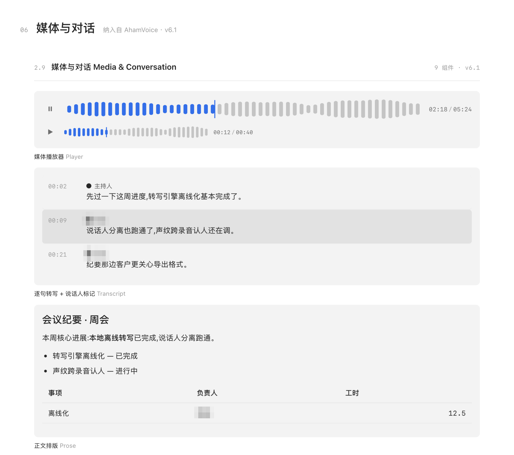
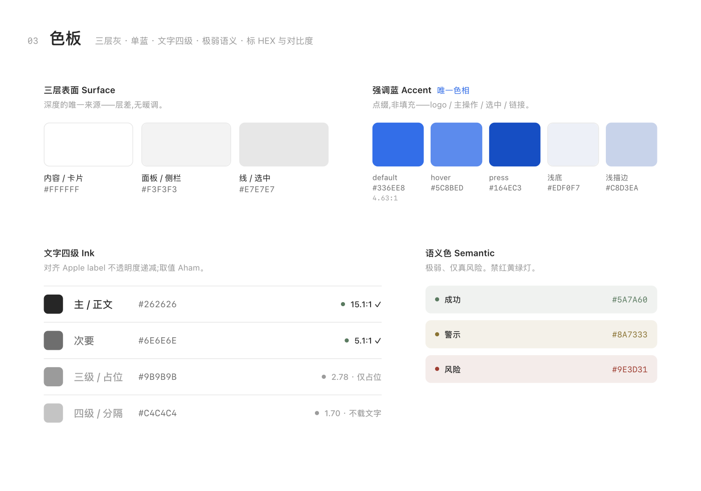
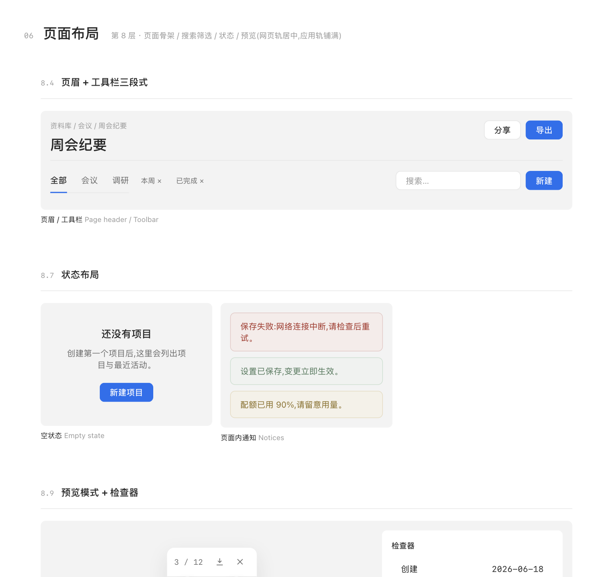
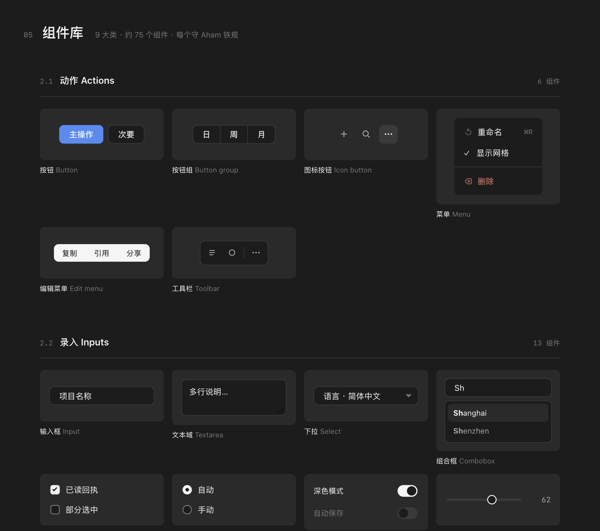

# Aham UI — 供 AI 消费的设计系统

> **Aham 应用矩阵**：**Aham UI** · [Aham Word](https://github.com/Aham-AIAPP/aham-word) · [Aham Survey](https://github.com/Aham-AIAPP/aham-survey) · [Aham Voice](https://github.com/Aham-AIAPP/aham-voice) · [Aham PPT](https://github.com/Aham-AIAPP/aham-ppt)

把设计语言写成一份**机器可读、自洽**的单一事实源——AI 据此产出，字体、颜色、间距处处一致。

**🖥 在线全景（所有组件就地预览）→ <https://aham-aiapp.github.io/aham-ui/>**

## 预览

> 以下截图取自[在线全景页](https://aham-aiapp.github.io/aham-ui/)——这一页本身就是用 Aham UI 做成的「活样板」。

<table>
  <tr>
    <td width="50%" valign="top">
      
       <b>组件库</b> · 约 75 个组件，分 9 大类，每件守铁规
    </td>
    <td width="50%" valign="top">
      
       <b>媒体与对话</b> · v6.1 招牌组件（播放器 / 逐句转写 / 对话输入）
    </td>
  </tr>
  <tr>
    <td width="50%" valign="top">
      
       <b>色板与文字</b> · 三层灰 + 单蓝 + 文字四级（带对比度）
    </td>
    <td width="50%" valign="top">
      
       <b>页面布局</b> · 页眉 / 搜索筛选 / 状态 / 预览
    </td>
  </tr>
</table>

**🌗 亮 / 暗双色**（全景页右上角可切换）：

## 设计性格

**冷色的纸、克制的金属感、对话式**——极简、克制、内容优先。

- **单一强调色**：钢蓝 `#336EE8`，只用于点缀（logo / 主操作 / 发送 / 选中）。"第一眼就注意到蓝色，就算超标。"
- **三层灰背景**（`#FFFFFF` / `#F3F3F3` / `#E7E7E7`），层级靠背景与留白、不靠阴影；卡片无边框无阴影，仅浮层有一层柔和阴影。
- **单一无衬线**（Inter + 雅黑/黑体），层级只靠字号与字重；数字用等宽 JetBrains Mono。
- **不靠颜色单独传达**：状态 = 符号 + 文字双通道；多类别用形状/文字区分（如说话人标记）。
- 亮 / 暗双色 · 无障碍 + RTL。

## 能力规模

- **八层规范**：原则 / 基础 / 控件与组件 / 组合规则 / 模式 / 介质落地 / 输入 / 系统支撑 / **页面布局体系**。
- **约 75 个组件**（CSS 参考实现），其中 **17 件配机读契约 + 就地预览**（button / input / card / dialog / table / nav / checkbox / radio / toggle / segmented / progress / slider / search / tooltip / popover / menu + 图标）。
- **三层 token 体系**（primitive → semantic → component），机读单一事实源。
- **页面布局分四轨**：网页（居中收口 + 12 栅格 + rem 断点）/ 应用 macOS（左对齐铺满 + 展开 pane）/ Office（Word·Excel·PPT）/ 邮件。
- 亮 / 暗双色 · 无障碍 + RTL + 容器查询 + 内容密度。

> **方法论**：框架 / 比例 / 方法参考 Apple HIG 与业内主流设计系统（Material / Carbon / Ant / Polaris / Fluent / GOV.UK 等），**取值全部自定**（不抄 hex/pt）。经 Apple HIG 完整性审计补全 30 项，再经业内横扫补全页面级布局缺口约 22 项。

## 怎么用（消费顺序）

> **铁律：值只从 token 取，绝不自由发挥。** 完整设计系统在 **[`design-system/`](./design-system/)** —— 一个自包含、供 AI 消费的包（规范 + 机读 token + 17 组件契约与就地预览 + 图标 + Office 落地 + 成品 dashboard）。仓库根只放门面/说明与在线全景。

| 用途 | 文件 |
|---|---|
| AI 消费入口 / 阅读顺序 | [`SKILL.md`](./design-system/SKILL.md) · [`AGENTS.md`](./design-system/AGENTS.md) · [`library-consumption.json`](./design-system/library-consumption.json) |
| 单一事实源（机读 token，亮+暗+文本样式+布局+尺寸+图标） | [`tokens.json`](./design-system/tokens.json) |
| 完整规范（八层） | [`DESIGN.md`](./design-system/DESIGN.md) |
| 品牌参考（叙述版） | [`README.md`](./design-system/README.md) |
| 运行时 CSS + 组件 CSS + 机读镜像 | [`colors_and_type.css`](./design-system/colors_and_type.css) · [`components.css`](./design-system/components.css) · [`css.json`](./design-system/css.json) |
| 组件契约 + 就地预览（17 件，含图标） | [`components/`](./design-system/components/) · [`preview/`](./design-system/preview/) |
| 图标（Lucide · ISC · 51 起始件 + 雪碧图） | [`icons/`](./design-system/icons/) |
| 参考实现 + 示范 | [`aham-ui.css`](./design-system/aham-ui.css) · [`examples/`](./design-system/examples/) |
| 成品 UI Kit | [`ui_kits/dashboard/`](./design-system/ui_kits/dashboard/) |
| Office 落地（HEX + 字体映射） | [`aham-ui-office.md`](./design-system/aham-ui-office.md) |
| 在线全景展示页（所有组件就地预览） | [`index.html`](./index.html) · [Pages](https://aham-aiapp.github.io/aham-ui/) |
| 设计依据（布局调研报告） | [`docs/`](./docs/) |

**AI 消费顺序**：`design-system/SKILL.md`（品牌要点）→ `tokens.json`（值）→ `DESIGN.md`（八层规则）→ `components/` + `preview/`（契约与预览）→ `colors_and_type.css` / `components.css`（运行时）→ `examples/` + `ui_kits/`（成品）→ `aham-ui-office.md`（Office）。

## 性质说明

这是**设计规范 + 参考实现（CSS）**，主要供 AI 据规范产出一致输出；组件 CSS 尚未在生产级 React / Swift 中逐一验证。

## 版本与许可

- 版本与下载：[Releases](https://github.com/Aham-AIAPP/aham-ui/releases)
- 变更记录：[CHANGELOG.md](CHANGELOG.md)（Keep a Changelog · SemVer）
- 参与贡献：[CONTRIBUTING.md](CONTRIBUTING.md)
- 许可：[MIT](LICENSE)

---

## 关于 Aham

> **把灵光一现，做成能用的 AI 工具。**

Aham 来自 *aha moment*。每个工具只把一件事做利落。

| 应用 | 一句话 |
|---|---|
| [Aham UI](https://github.com/Aham-AIAPP/aham-ui) | 供 AI 消费的设计系统——写一次规范，AI 产出处处一致 |
| [Aham Word](https://github.com/Aham-AIAPP/aham-word) | 供 AI 消费的 Word 规范——AI 据规范产出处处一致的 .docx |
| [Aham Survey](https://github.com/Aham-AIAPP/aham-survey) | 现场调研工具（macOS）——聊一圈，调研结果自己长出来 |
| [Aham Voice](https://github.com/Aham-AIAPP/aham-voice) | 录音转写与会议纪要（macOS）——录一段会，纪要已经写好 |
| [Aham PPT](https://github.com/Aham-AIAPP/aham-ppt) | 咨询级 AI PPT 制作技能——丢一堆素材，幻灯片出来了 |

### 关注 · 交流

公众号看更多 AI 工具实践与更新；也欢迎扫码加我，交流与反馈。

