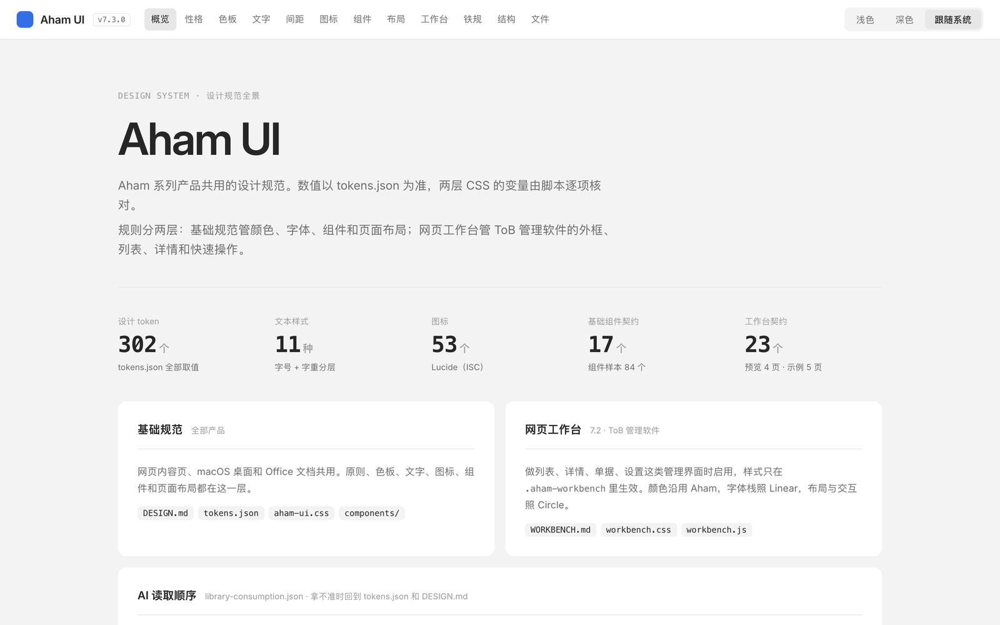
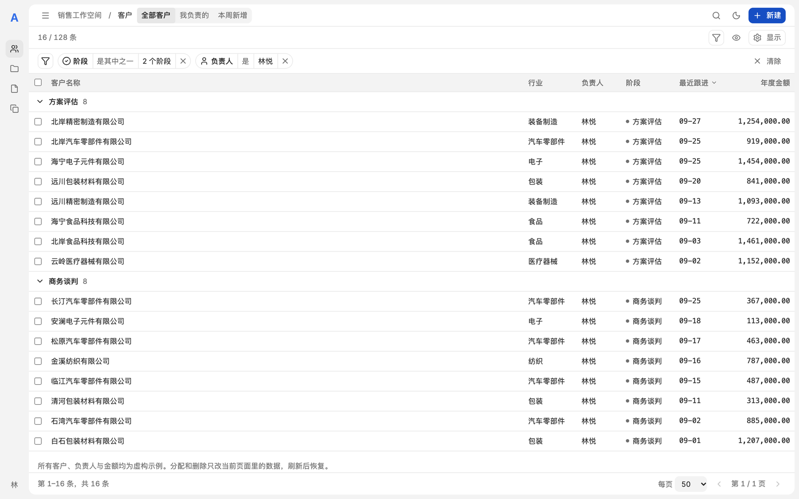
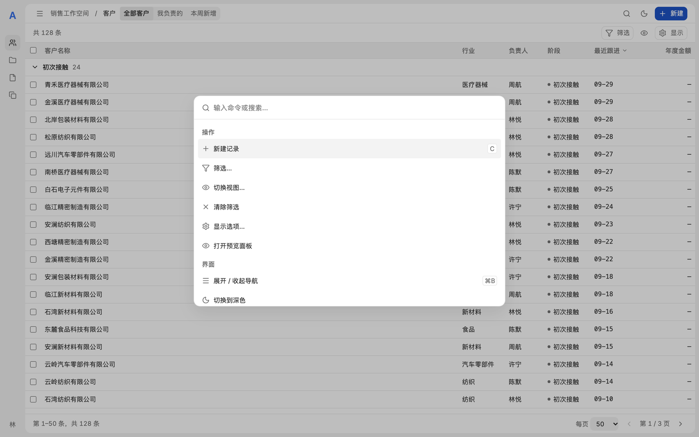
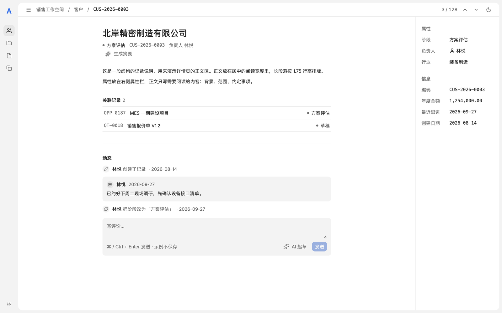
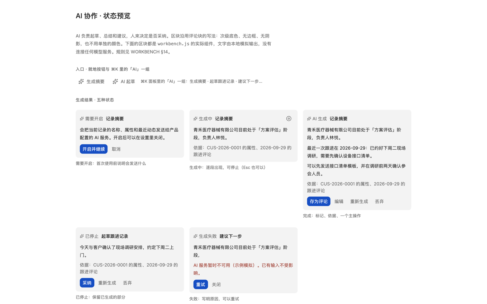
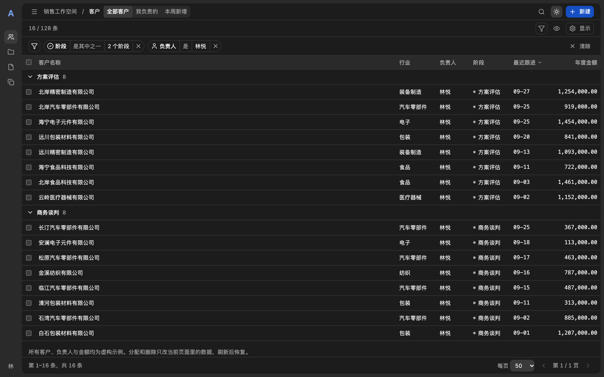

# Aham UI — 供 AI 消费的设计系统

[](https://github.com/Aham-AIAPP/aham-ui/releases)
[](LICENSE)
[](https://aham-aiapp.github.io/aham-ui/)
[](#)
[](assets/wechat-qr.png)


## 缘起

同一个界面让 AI 做三遍，字号、间距和颜色常常三遍都不一样。提示词写得再细，它每次还是自己挑值。

Aham UI 把这些值和规则放进一个仓库。取值全在 `tokens.json`，规则写在 `DESIGN.md` 和 `WORKBENCH.md`。AI 每次从这里取值，同一个需求做几遍，结果都对得上。

## 定位

- **一处取值**：颜色、字号、间距、圆角和控件尺寸只写在 `tokens.json`，共 302 个。三份运行时 CSS 跟着它走，`scripts/lint-design.mjs` 逐项核对。
- **规则成文**：`DESIGN.md` 从设计原则写到页面布局，共 0–8 章。`WORKBENCH.md` 专管 ToB 管理界面。
- **组件带契约**：40 份 JSON 契约写明结构、变体和禁用写法。AI 按契约拼页面，契约里没有的组件不自己造。
- **外观**：冷灰三层底色，只用一个蓝色 `#336EE8`，静置无阴影，状态用 6px 圆点加文字。
- **字体**：字体栈照 Linear。无衬线用 Inter Variable，随包附带；等宽用 Berkeley Mono，没买授权时由 JetBrains Mono 接替。

## 内容

按仓库目录排列：

| 位置 | 内容 |
|---|---|
| `design-system/tokens.json` | 全部取值：亮暗两套颜色、11 种文本样式、间距、圆角、控件与工作台尺寸 |
| `design-system/DESIGN.md` | 基础规范：原则、基础、组件、组合、模式、介质、输入、系统支撑、页面布局 |
| `design-system/WORKBENCH.md` | 网页工作台规范：外框、列表与筛选、命令面板、列表键盘与详情、设置页、AI 协作、单据页 |
| `design-system/components/` | 40 份组件契约：基础组件 17 份，工作台组合 23 份 |
| `design-system/aham-ui.css`、`aham-ui.js` | 基础层运行时，内容页用 |
| `design-system/workbench.css`、`workbench.js` | 工作台运行时，原生 ES 模块，零依赖 |
| `design-system/preview/` | 23 个预览页：基础组件 17 个、版式 2 个、工作台状态 4 个 |
| `design-system/examples/` | 20 个示例页，含列表、记录详情、单据、设置 |
| `design-system/icons/` | Lucide 图标 53 个（ISC） |
| `design-system/fonts/` | Inter Variable 4.1 正体、斜体与授权文本（SIL OFL） |
| `design-system/aham-ui-office.md` | Word、Excel、PPT 的颜色与字体映射 |
| `index.html` | 在线全景页，12 个区块，数值和清单由脚本生成 |
| `scripts/`、`tests/` | 生成脚本、设计 lint 和测试，每次推送由 CI 运行 |
| `docs/` | 工作台规划和页面布局调研记录 |

## 预览

<table>
<tr>
<td width="50%"><br><sub><b>全景页</b> · 色板、文本样式、契约清单由脚本从包内文件生成</sub></td>
<td width="50%"><br><sub><b>列表页</b> · 四段式筛选条件，按阶段分组</sub></td>
</tr>
<tr>
<td width="50%"><br><sub><b>⌘K 命令面板</b> · 页面上的全部操作都能在这里找到</sub></td>
<td width="50%"><br><sub><b>记录详情</b> · 720px 正文、240px 属性栏、动态流</sub></td>
</tr>
<tr>
<td width="50%"><br><sub><b>AI 协作</b> · 生成内容带标记和依据，可停止、重试</sub></td>
<td width="50%"><br><sub><b>深色</b> · 浅色、深色、跟随系统三档</sub></td>
</tr>
</table>

全部页面在线可看：<https://aham-aiapp.github.io/aham-ui/>

## 使用方法

**交给 AI**：把仓库地址 `https://github.com/Aham-AIAPP/aham-ui` 发给 Claude，让它按 `design-system/` 做；也可以把 `design-system/` 目录直接交给别的 AI。

**AI 读取顺序**以 `design-system/library-consumption.json` 为准：`tokens.json` → `DESIGN.md` → `WORKBENCH.md`（做管理界面时）→ `components/` → `AGENTS.md` → `aham-ui.css` / `workbench.css` / `workbench.js` → 预览页和示例页。`colors_and_type.css`、`components.css` 只给组件预览页用。

**在页面里引用**：内容页用基础层，管理界面用工作台。复制 CSS 时把 `fonts/`、`icons/` 一起带上。

```html
<link rel="stylesheet" href="design-system/aham-ui.css">
<link rel="stylesheet" href="design-system/workbench.css">
```

**换品牌**：复制 `tokens.json`，改色值、字号和间距。`workbench-tokens.css` 由脚本重新生成；`aham-ui.css` 和 `colors_and_type.css` 手工同步，lint 会列出对不上的变量。规则文件不用改。

**本地预览与校验**：在仓库根目录启动静态服务，打开 `http://127.0.0.1:8765/`。

```bash
python3 -m http.server 8765 --bind 127.0.0.1
node scripts/build-workbench.mjs --check
node scripts/extract-components-css.mjs --check
node scripts/build-panorama.mjs --check
node scripts/lint-design.mjs
node --test tests/*.test.mjs
```

## 网页工作台

7.2 起新增，面向 ToB 管理软件。颜色、形状、字号和字重听 Aham；字体栈、布局和交互听 Linear。布局与交互参考 [Circle](https://github.com/ln-dev7/circle)，它是 Linear 风格的开源实现。

- 规范：[WORKBENCH.md](design-system/WORKBENCH.md) §1–14 · [7.2 规划与记录](docs/workbench-7.2-plan.md)
- 状态预览：[筛选](design-system/preview/workbench-filter.html) · [列表键盘与详情](design-system/preview/workbench-detail.html) · [快速操作](design-system/preview/workbench-actions.html) · [AI 协作](design-system/preview/workbench-ai.html)
- 页面示例：[外框](design-system/examples/workbench-shell.html) · [列表](design-system/examples/customer-list.html) · [记录详情](design-system/examples/record-detail.html) · [单据](design-system/examples/crm-quotation.html) · [设置](design-system/examples/settings.html)
- 示例只用虚构数据。权限、审批、审计、并发和服务端保存要由产品接入。
- 改了 tokens、图标、契约或读取顺序后，运行 `node scripts/build-panorama.mjs` 重写全景页里的数值和清单，其余部分手写。

---

## 更新记录

最新是 v7.3.0（2026-09-30）：字体改用 Linear 的字体栈，随包附带 Inter Variable。

[Releases](https://github.com/Aham-AIAPP/aham-ui/releases) · [CHANGELOG](CHANGELOG.md)（Keep a Changelog · SemVer） · [CONTRIBUTING](CONTRIBUTING.md) · [MIT](LICENSE)

## 关于 Aham

> 把灵光一现做成能用的 AI 工具。Aham 来自 *aha moment*，每个工具只把一件事做好，共用同一套设计规范。

| 应用 | 一句话 |
|---|---|
| **Aham UI**（本仓库） | 供 AI 消费的设计系统——写一次规范，AI 产出处处一致 |
| [Aham Word](https://github.com/Aham-AIAPP/aham-word) | 供 AI 消费的 Word 规范——AI 据规范产出处处一致的 .docx |
| [Aham PPT](https://github.com/Aham-AIAPP/aham-ppt) | 克制的 AI PPT 制作技能——把素材做成方案级 PPT |
| Aham Excel | 供 AI 消费的 Excel 规范——开发中 |
| [Aham Voice](https://github.com/Aham-AIAPP/aham-voice) | 录音转写与会议纪要（macOS）——本地离线转写，纪要走你自己的模型 |
| [Aham Survey](https://github.com/Aham-AIAPP/aham-survey) | 现场调研工具（macOS）——本地优先，把现场对话做成结构化调研成果 |

来源与脱敏说明见 [`ORIGIN.md`](ORIGIN.md)。

### 关注 · 交流

公众号写 AI 工具的实践和更新。也欢迎扫码加我微信，交流、反馈都可以。

<p></p>
